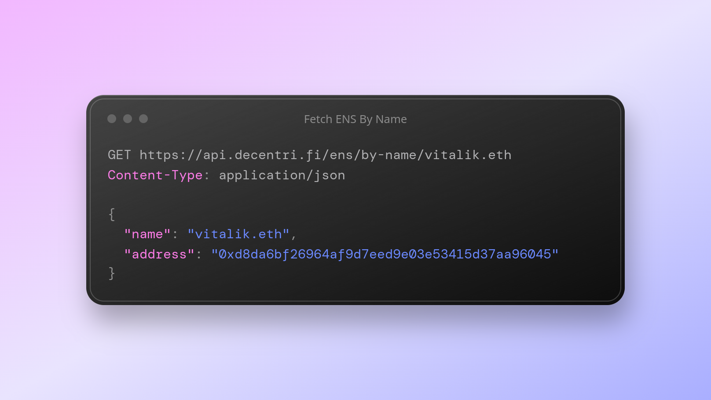

# 🔗 ENS API

ENS, short for Ethereum Name Service, is a decentralized and blockchain-based naming system designed to simplify interactions with the Ethereum ecosystem. It serves as a bridge between human-readable domain names and Ethereum addresses, making it easier for users to send and receive cryptocurrencies, interact with smart contracts, and access decentralized applications (dApps).

<figure><figcaption></figcaption></figure>

ENS replaces the need to remember long and complex Ethereum addresses with user-friendly domain names, like "myethereumwallet.eth." It functions similarly to the traditional Domain Name System (DNS) on the internet but operates on the Ethereum blockchain, providing a secure and censorship-resistant way to link names to blockchain resources.

### By Name


Example: \
[https://api.decentri.fi/ens/by-name/vitalik.eth](https://api.decentri.fi/ens/by-name/vitalik.eth)








ENS Name of a user



```json
{
  "name": "vitalik.eth",
  "address": "0xd8da6bf26964af9d7eed9e03e53415d37aa96045"
}
```




### By Address


Example: \
[https://api.decentri.fi/ens/by-address/0xd8da6bf26964af9d7eed9e03e53415d37aa96045](https://api.decentri.fi/ens/by-address/0xd8da6bf26964af9d7eed9e03e53415d37aa96045)












```
{
   "name": "vitalik.eth",
   "address": "0xd8da6bf26964af9d7eed9e03e53415d37aa96045"
}
```


